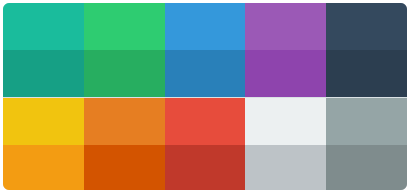
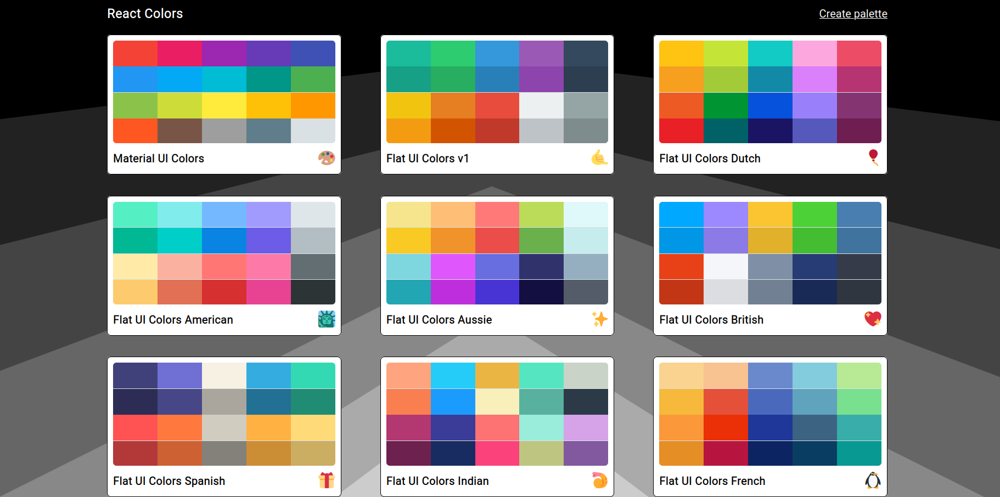
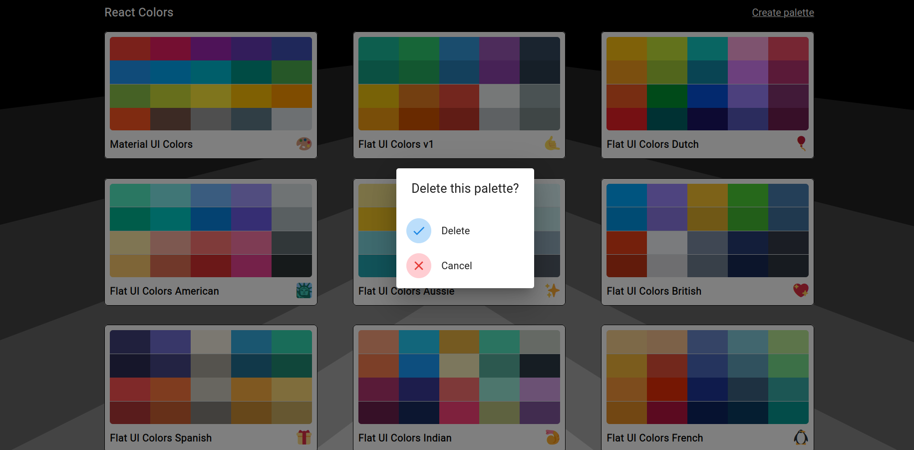
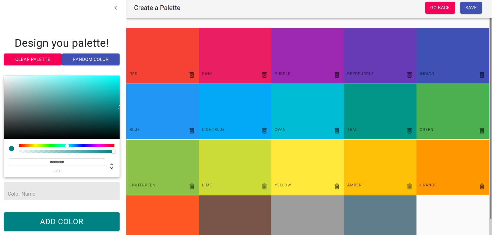
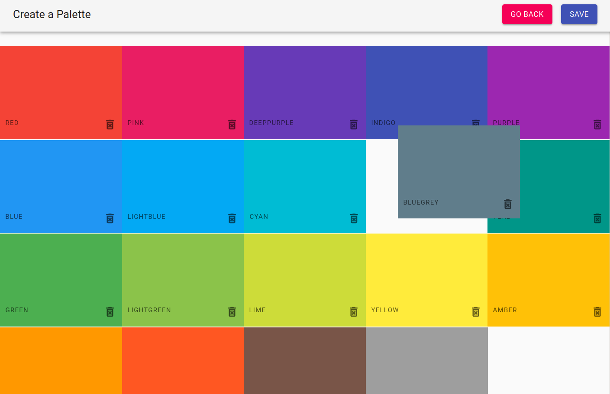
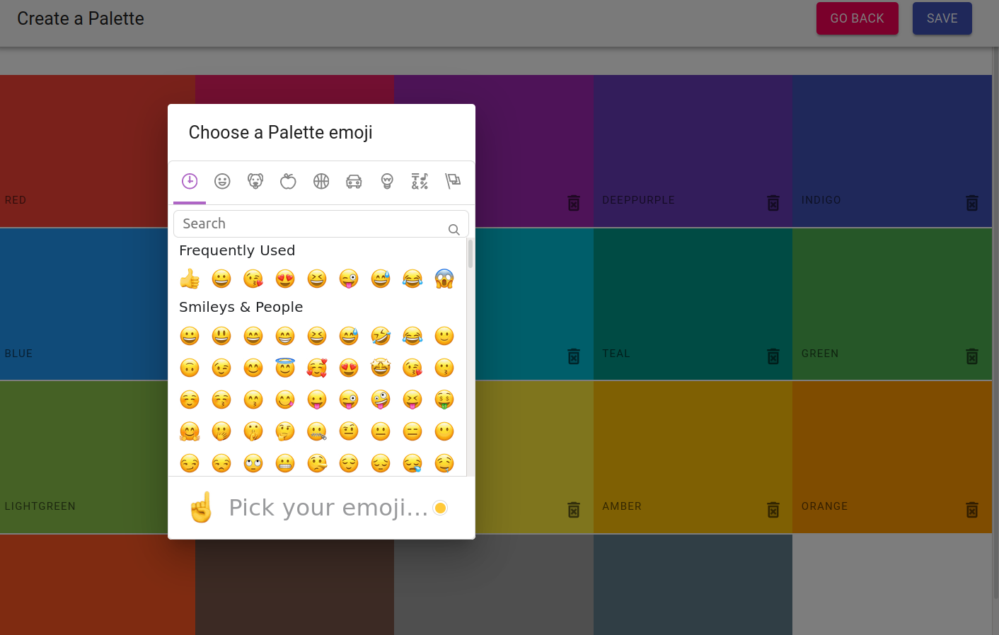
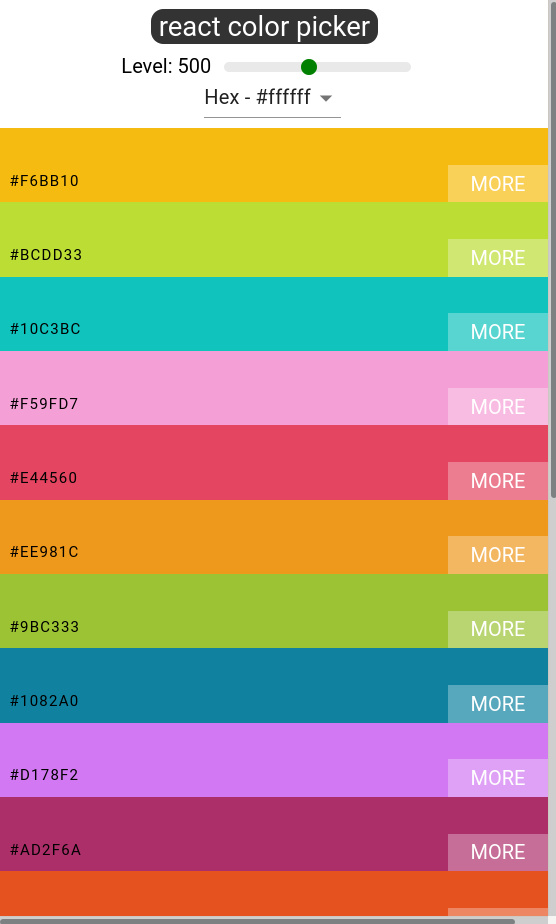

  

<h3 align="center">Color Palette</h3>

---

 
      

## 📝 Table of Contents

- [About](#about)
- [Preview](#preview)
- [Built Using](#built_using)
- [Authors](#authors)
- [Acknowledgments](#acknowledgement)

## 🧐 About 

This project is inspired by Colt Steele's code boot camp, making a Single Page Application to allow user to copy a different range of colors.

<b>Live link: https://color-palette-delta.vercel.app/</b>

## 🚀 Preview 

## ⛏️ Built Using 

- [React](https://reactjs.org/) - Web Framework
- [React-router](https://reactrouter.com/core/guides/quick-start) - Client Side Router Library
- [Material UI](https://material-ui.com/) - UI Library
- [react-sortable-hoc](https://github.com/clauderic/react-sortable-hoc) - Drag & Drop Library
- [react-material-ui-form-validator ](https://github.com/NewOldMax/react-material-ui-form-validator) - Form Validation Library
- JSS - Solution of CSS in JS provided by Material UI
- Local Storage - Store color palettes temporarily
- Responsive design provided

## ✍️ Authors 

- [@Ollie](https://github.com/Ollie-lee) - Idea & Initial work

## 🎉 Acknowledgements 

- Colt Steele, for his excellent course on Udemy!

